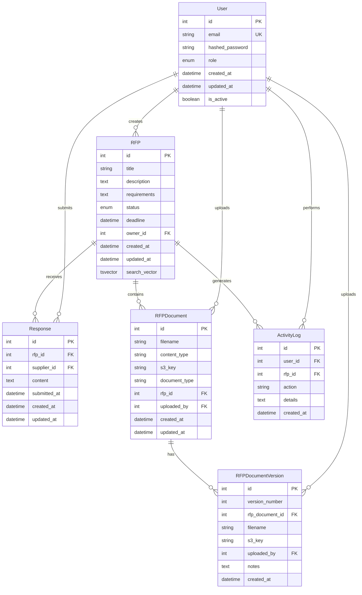

# Database Schema Documentation

## Overview

The RFP Contract Management System uses PostgreSQL as its primary database with async SQLAlchemy as the ORM. The schema is designed to support the complete RFP lifecycle from creation to contract award.

## Entity Relationship Diagram



## Tables

### Users Table

The `users` table stores information about all system users (buyers and suppliers).

```sql
CREATE TABLE users (
    id SERIAL PRIMARY KEY,
    email VARCHAR(255) UNIQUE NOT NULL,
    hashed_password VARCHAR(255) NOT NULL,
    role user_role NOT NULL DEFAULT 'buyer',
    created_at TIMESTAMP WITH TIME ZONE DEFAULT NOW(),
    updated_at TIMESTAMP WITH TIME ZONE DEFAULT NOW(),
    is_active BOOLEAN DEFAULT TRUE
);
```

**Columns:**
- `id`: Primary key, auto-incrementing integer
- `email`: Unique email address for login
- `hashed_password`: bcrypt hashed password
- `role`: Enum value ('buyer' or 'supplier')
- `created_at`: Timestamp when user was created
- `updated_at`: Timestamp when user was last updated
- `is_active`: Boolean flag for account status

### RFPs Table

The `rfps` table stores all RFP documents and their metadata.

```sql
CREATE TABLE rfps (
    id SERIAL PRIMARY KEY,
    title VARCHAR(500) NOT NULL,
    description TEXT,
    requirements TEXT,
    status rfp_status NOT NULL DEFAULT 'DRAFT',
    deadline TIMESTAMP WITH TIME ZONE,
    owner_id INTEGER NOT NULL REFERENCES users(id),
    created_at TIMESTAMP WITH TIME ZONE DEFAULT NOW(),
    updated_at TIMESTAMP WITH TIME ZONE DEFAULT NOW(),
    search_vector tsvector
);
```

**Columns:**
- `id`: Primary key, auto-incrementing integer
- `title`: RFP title (max 500 characters)
- `description`: Detailed RFP description
- `requirements`: Specific requirements and criteria
- `status`: Current status of the RFP (enum)
- `deadline`: Optional deadline for responses
- `owner_id`: Foreign key to users table (buyer who created the RFP)
- `created_at`: Timestamp when RFP was created
- `updated_at`: Timestamp when RFP was last updated
- `search_vector`: Full-text search vector for PostgreSQL search

### RFP Documents Table

The `rfp_documents` table stores metadata about files attached to RFPs.

```sql
CREATE TABLE rfp_documents (
    id SERIAL PRIMARY KEY,
    filename VARCHAR(255) NOT NULL,
    content_type VARCHAR(100),
    s3_key VARCHAR(500),
    document_type VARCHAR(50),
    rfp_id INTEGER NOT NULL REFERENCES rfps(id) ON DELETE CASCADE,
    uploaded_by INTEGER NOT NULL REFERENCES users(id),
    created_at TIMESTAMP WITH TIME ZONE DEFAULT NOW(),
    updated_at TIMESTAMP WITH TIME ZONE DEFAULT NOW()
);
```

### RFP Document Versions Table

The `rfp_document_versions` table tracks different versions of uploaded documents.

```sql
CREATE TABLE rfp_document_versions (
    id SERIAL PRIMARY KEY,
    version_number INTEGER NOT NULL,
    rfp_document_id INTEGER NOT NULL REFERENCES rfp_documents(id) ON DELETE CASCADE,
    filename VARCHAR(255) NOT NULL,
    s3_key VARCHAR(500),
    uploaded_by INTEGER NOT NULL REFERENCES users(id),
    notes TEXT,
    created_at TIMESTAMP WITH TIME ZONE DEFAULT NOW(),
    UNIQUE(rfp_document_id, version_number)
);
```

### Responses Table

The `responses` table stores supplier responses to RFPs.

```sql
CREATE TABLE responses (
    id SERIAL PRIMARY KEY,
    rfp_id INTEGER NOT NULL REFERENCES rfps(id) ON DELETE CASCADE,
    supplier_id INTEGER NOT NULL REFERENCES users(id),
    content TEXT NOT NULL,
    submitted_at TIMESTAMP WITH TIME ZONE DEFAULT NOW(),
    created_at TIMESTAMP WITH TIME ZONE DEFAULT NOW(),
    updated_at TIMESTAMP WITH TIME ZONE DEFAULT NOW(),
    UNIQUE(rfp_id, supplier_id)
);
```

### Activity Log Table

The `activity_logs` table tracks user actions for audit purposes.

```sql
CREATE TABLE activity_logs (
    id SERIAL PRIMARY KEY,
    user_id INTEGER REFERENCES users(id),
    rfp_id INTEGER REFERENCES rfps(id),
    action VARCHAR(100) NOT NULL,
    details TEXT,
    created_at TIMESTAMP WITH TIME ZONE DEFAULT NOW()
);
```

## Enums

### User Role Enum

```sql
CREATE TYPE user_role AS ENUM ('buyer', 'supplier');
```

### RFP Status Enum

```sql
CREATE TYPE rfp_status AS ENUM (
    'DRAFT',
    'PUBLISHED',
    'RESPONSE_SUBMITTED',
    'UNDER_REVIEW',
    'APPROVED',
    'REJECTED'
);
```

## Indexes

### Performance Indexes

```sql
-- Full-text search index
CREATE INDEX idx_rfps_search_vector ON rfps USING GIN(search_vector);

-- Status-based queries
CREATE INDEX idx_rfps_status ON rfps(status);
CREATE INDEX idx_rfps_owner_status ON rfps(owner_id, status);

-- Chronological queries
CREATE INDEX idx_rfps_created_at ON rfps(created_at DESC);
CREATE INDEX idx_responses_submitted_at ON responses(submitted_at DESC);
```

## Data Relationships

### One-to-Many Relationships

1. **User → RFPs**: One user (buyer) can create many RFPs
2. **User → Responses**: One user (supplier) can submit many responses
3. **User → Documents**: One user can upload many documents
4. **RFP → Documents**: One RFP can have many documents
5. **RFP → Responses**: One RFP can receive many responses
6. **Document → Versions**: One document can have many versions

### Many-to-Many Relationships

1. **Users ↔ RFPs**: Through responses (suppliers respond to RFPs)
2. **Users ↔ Documents**: Through document uploads and versions

## Data Integrity

### Constraints

1. **Foreign Key Constraints**: All foreign keys have proper referential integrity
2. **Unique Constraints**: 
   - Email addresses must be unique
   - One response per supplier per RFP
   - Unique version numbers per document
3. **Check Constraints**: Enum values are enforced at the database level
4. **Not Null Constraints**: Required fields are marked as NOT NULL

### Cascading Deletes

- Deleting a user cascades to their RFPs, responses, and activity logs
- Deleting an RFP cascades to its documents, responses, and activity logs
- Deleting a document cascades to its versions

## Migration Strategy

The database schema is managed using Alembic migrations:

1. **Initial Migration**: Creates all tables, enums, and basic indexes
2. **Versioning Migration**: Adds document versioning support
3. **Search Migration**: Adds full-text search capabilities
4. **Future Migrations**: Can be added as needed for new features

## Performance Considerations

1. **Indexing Strategy**: Indexes are created on frequently queried columns
2. **Full-Text Search**: GIN index on search_vector for fast text search
3. **Connection Pooling**: Async SQLAlchemy with connection pooling
4. **Query Optimization**: Use of async queries and proper joins
5. **Partitioning**: Consider partitioning for large tables in production

## Security Considerations

1. **Data Encryption**: Sensitive data should be encrypted at rest
2. **Access Control**: Database access should be restricted to application users
3. **Audit Trail**: Activity logs provide comprehensive audit trail
4. **Data Retention**: Consider data retention policies for compliance
5. **Backup Strategy**: Regular backups with point-in-time recovery